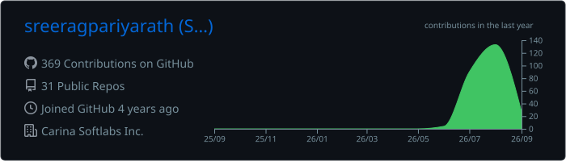
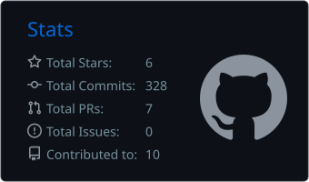
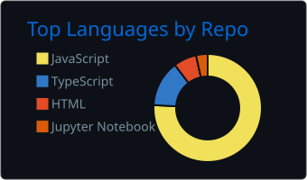
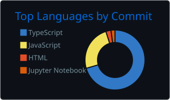
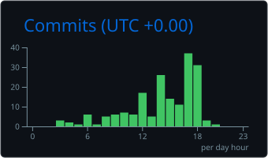

# Hi, I'm Sreerag P 👋

  <strong>Full Stack Developer • Open Source Builder • AI Enthusiast</strong>

Building scalable backend systems, developer tools, AI-powered applications, and modern web platforms.

---

# 🚀 Currently Building

### 🧠 Norix

**Offline-first Repository Intelligence CLI**

Analyze unfamiliar repositories, detect technologies, understand architecture, and generate insights to help developers onboard faster.

### Current Focus

- AI-powered Developer Tools
- Repository Intelligence
- Backend Architecture
- System Design
- Performance Engineering
- Clean Architecture

---

# ❤️ Open Source

I enjoy building practical software that solves real engineering problems.

My current work focuses on:

- AI-powered developer tools
- Repository intelligence
- Backend infrastructure
- CLI applications
- Modern web platforms
- Productivity software

If one of my projects helps your work, consider supporting future development through **GitHub Sponsors**.

---

# 🛠 Tech Stack

## Frontend

## Backend

## Database

## Cloud & DevOps

## Developer Tools

## AI Tools

---

# 📦 Featured Projects

## 🧠 Norix

Offline-first Repository Intelligence CLI for analyzing repositories, detecting technologies, and generating architecture insights.

**Highlights**

- Repository analysis
- Technology detection
- Architecture visualization
- Dependency insights
- Developer productivity

---

## 🍔 QuickBite

Modern food ordering and restaurant management platform.

**Highlights**

- Customer ordering
- Restaurant dashboard
- Admin portal
- Analytics
- REST APIs

---

## 📚 Hupe Academy

Interactive educational platform for children.

**Highlights**

- Curriculum management
- Educational games
- Progress tracking
- Content management
- Audio system
- Performance optimization

---

# 💡 Areas of Interest

- Artificial Intelligence
- Backend Engineering
- Distributed Systems
- System Design
- Developer Experience (DX)
- Performance Optimization
- Clean Architecture
- Open Source

---

# 📈 GitHub Statistics

  

  
  

  
  

---

# 📫 Connect

---

> **Building practical software, contributing to open source, and creating developer tools that solve real-world engineering problems.**
